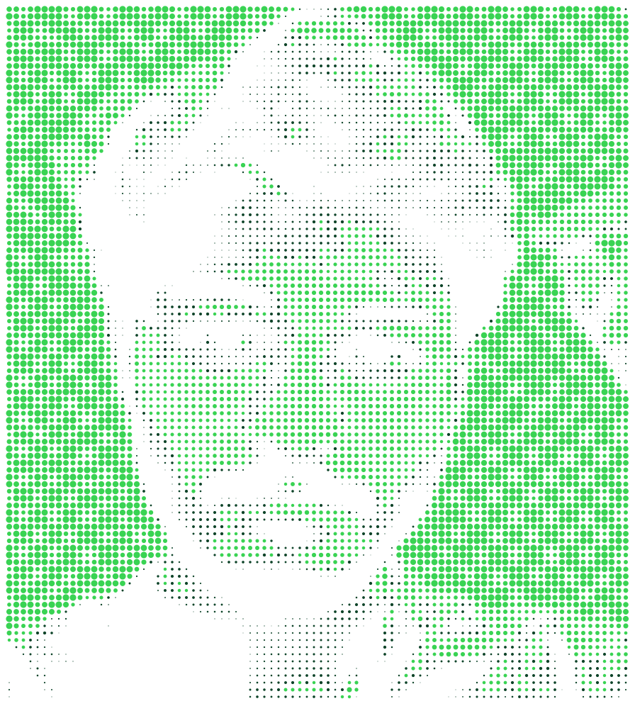
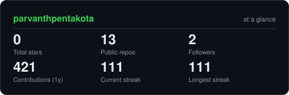

<div align="center">

<!-- PORTRAIT - will be generated in Step 3 -->


<br>

<!-- NAME / TAGLINE - animated typing -->
<a href="https://github.com/parvanthpentakota">
  
</a>

<br>

<!-- SOCIALS -->
<a href="https://github.com/parvanthpentakota">
  
</a>

<a href="mailto:parvanth2310@gmail.com">
  
</a>


</div>

---
## `~/` whoami

```console
$ cat about.txt
```
Hi, I'm **Parvanth Pentakota** — a developer focused on building strong problem-solving skills and becoming a well-rounded software engineer.

- 💻 Strengthening my skills in **C++ and Python**
- 🧠 Focused on **Data Structures & Algorithms and Competitive Programming**
- 🔐 Exploring **Cybersecurity, Bug Bounty, and Web Security**
- 🚀 Improving through **problem solving, projects, and continuous learning**

<br>

<div align="center">

## `~/` toolbox


</div>

<picture>
  <source media="(prefers-color-scheme: dark)" srcset="assets/portrait-blue-dark.svg">
  <source media="(prefers-color-scheme: light)" srcset="assets/portrait-blue-light.svg">
  
</picture>


---

<div align="center">

## `~/` skill radar

<table>
<tr>
<td width="50%" align="center">

<picture>
  <source media="(prefers-color-scheme: dark)" srcset="assets/radar-dark.svg">
  <source media="(prefers-color-scheme: light)" srcset="assets/radar-light.svg">
  
</picture>

</td>

<td width="50%" align="center">

<picture>
  <source media="(prefers-color-scheme: dark)" srcset="assets/radar-langs-dark.svg">
  <source media="(prefers-color-scheme: light)" srcset="assets/radar-langs-light.svg">
  
</picture>

</td>
</tr>
</table>

</div>

---

<picture>
  <source media="(prefers-color-scheme: dark)" srcset="https://raw.githubusercontent.com/parvanthpentakota/parvanthpentakota/output/snake-dark.svg">
  <source media="(prefers-color-scheme: light)" srcset="https://raw.githubusercontent.com/parvanthpentakota/parvanthpentakota/output/snake.svg">
  
</picture>

</div>

---

<div align="center">

## `~/` the numbers

<picture>
  <source media="(prefers-color-scheme: dark)" srcset="assets/card-stats-dark.svg">
  <source media="(prefers-color-scheme: light)" srcset="assets/card-stats-light.svg">
  
</picture>

</div>